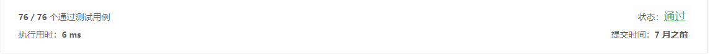

### 题目

给定一个只包括 '('，')'，'{'，'}'，'['，']' 的字符串，判断字符串是否有效。

有效字符串需满足：

左括号必须用相同类型的右括号闭合。

左括号必须以正确的顺序闭合。

注意空字符串可被认为是有效字符串。

### 解答:

```java
class Solution {
    public boolean isValid(String s) {
        Stack<Character> stack = new Stack<>();
				for (int i = 0; i < s.length(); i++) {
						char charAt = s.charAt(i);
						if (stack.empty()) {
								stack.push(charAt);
								continue;
						}
						switch (charAt) {
								case ')':
										if ('(' == stack.peek()) {
												stack.pop();
										}else {
												stack.push(charAt);
										}
										break;
								case ']':
										if ('[' == stack.peek()) {
												stack.pop();
										}else {
												stack.push(charAt);
										}
										break;
								case '}':
										if ('{' == stack.peek()) {
												stack.pop();
										} else {
												stack.push(charAt);
										}
										break;
								case '(':
								case '[':
								case '{':
										stack.push(charAt);
										break;
						}
				}
				return stack.empty();
    }
}
```

### 结果

  
